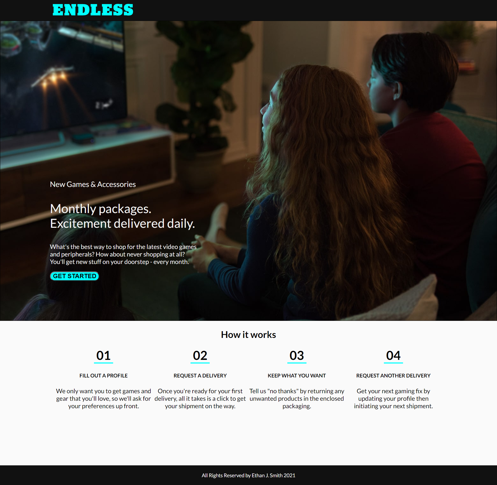

# Endless Assessment

## Table of Contents

- [Description](#description)

- [Screenshots](#screenshots)

- [Installation](#installation)

- [Tests](#tests)

- [Usage](#usage)

- [Contributing](#contributing)

- [Technologies](#technologies)

- [Questions](#questions)

- [License](#license)

---

## Description:

For this project, I recreated a webpage from an image given to me. I used HTML5 to create the page and styled it with CSS3. There is a modal that pops up when the "get started" button is clicked. It uses JavaScript to change the display property, making it visible, and can redirect the user to the project's Github repo.

---

## Screenshots:

[Link to Page](https://ejsmith13.github.io/endless/)

---

## Installation

To install the necessary dependencies use the following command:

      n/a

---

## Tests

To run tests use the following command:

      n/a

---

## Usage:

Any one is free to view this project. It can be viewed by opening the index.html file in your browser or visiting the page at:

[Endless](https://ejsmith13.github.io/endless/)

## Contributing:

---

## Technologies Used

For this project I used:

HTML, CSS, and JavaScript

---

## Questions

My name is Ethan Smith if you have questions about this project, please visit my github account (linked below) or feel free to send me an email.

GitHub account: https://github.com/ejsmith13

Email: ejsmithwork@gmail.com

---

## License

https://opensource.org/licenses/MIT

Copyright (c) 2021 Ethan Smith

      Permission is hereby granted, free of charge, to any person obtaining a copy
      of this software and associated documentation files (the "Software"), to deal
      in the Software without restriction, including without limitation the rights
      to use, copy, modify, merge, publish, distribute, sublicense, and/or sell
      copies of the Software, and to permit persons to whom the Software is
      furnished to do so, subject to the following conditions:

      The above copyright notice and this permission notice shall be included in all
      copies or substantial portions of the Software.

      THE SOFTWARE IS PROVIDED "AS IS", WITHOUT WARRANTY OF ANY KIND, EXPRESS OR
      IMPLIED, INCLUDING BUT NOT LIMITED TO THE WARRANTIES OF MERCHANTABILITY,
      FITNESS FOR A PARTICULAR PURPOSE AND NONINFRINGEMENT. IN NO EVENT SHALL THE
      AUTHORS OR COPYRIGHT HOLDERS BE LIABLE FOR ANY CLAIM, DAMAGES OR OTHER
      LIABILITY, WHETHER IN AN ACTION OF CONTRACT, TORT OR OTHERWISE, ARISING FROM,
      OUT OF OR IN CONNECTION WITH THE SOFTWARE OR THE USE OR OTHER DEALINGS IN THE
      SOFTWARE.
